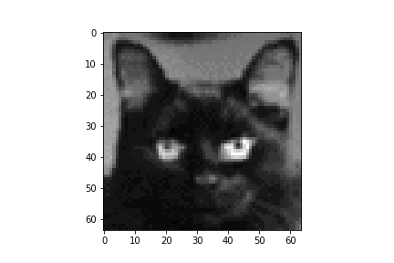
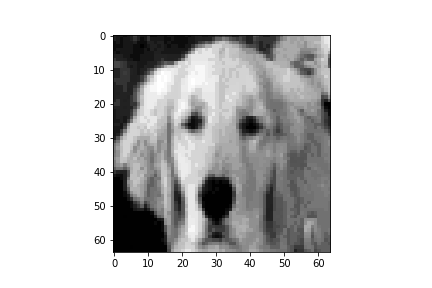
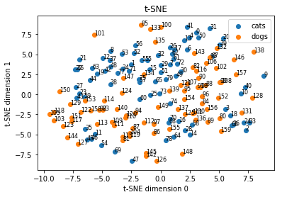
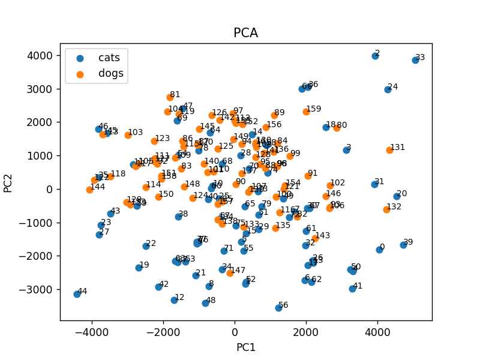

# High-dimensional-data-analysis

There are two datasets containing pictures of cats and dogs. The pictures are stored as text in the CSV files. The files contain a matrix with 4096 rows and 80 columns. Each column is a single pet and each value of the columns shows brightness of a pixel. Examples of images are shown below:

 
The goal of this work is to analyze the datasets using PCA and t-SNE.
There is visualization of the high dimensional data on 2 and 3 dimensional space:

 
